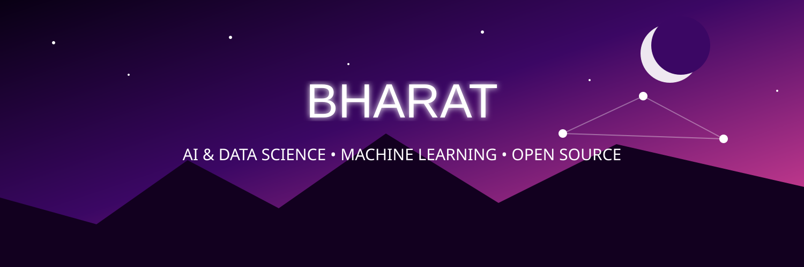

  

<h1 align="center"> Bharat </h1>

<h3 align="center">
Artificial Intelligence & Data Science Student | Python Developer | Tech Enthusiast
</h3>

---

# 👩‍💻 About Me

- 🎓 Second-Year B.Tech Artificial Intelligence & Data Science Student at **CGC University, Mohali**
- 💻 Aspiring Data Analyst
- 🐍 Python Developer
- 🌱 Currently Learning
  - Object-Oriented Programming (OOP)
  - Data Structures & Algorithms
  - SQL
  - Git & GitHub
- 💡 Passionate about Artificial Intelligence, Open Source and Problem Solving.
- 🎯 Goal: Build intelligent AI applications that solve real-world problems.

---

# 🛠️ Tech Stack

---

# 📊 GitHub Statistics

---

# 📈 Contribution Graph

---

# 🐍 Contribution Snake

---

# 📬 Connect With Me

  
  &nbsp;&nbsp;
  
  &nbsp;&nbsp;
  

---

<h3 align="center">
✨ Think • Learn • Build • Repeat ✨
</h3>
